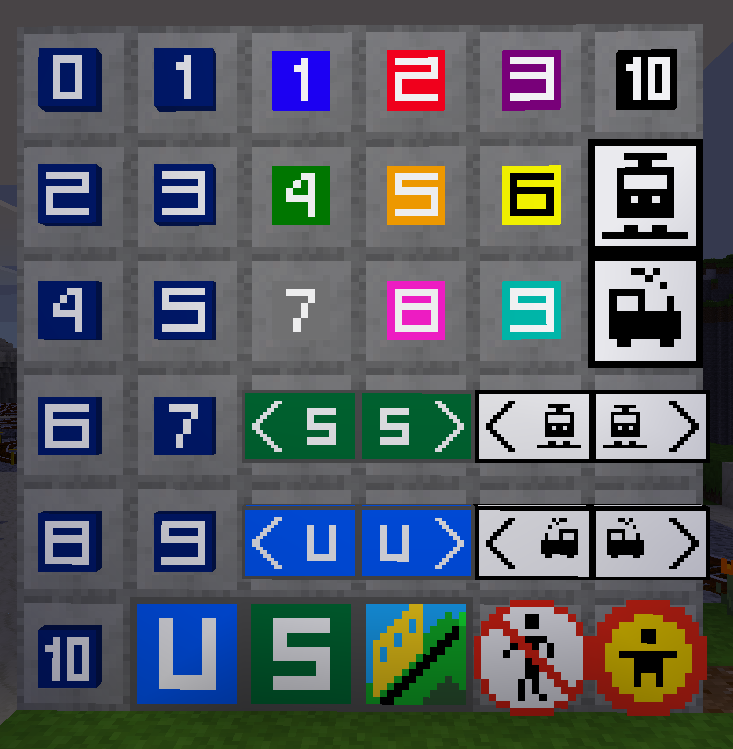

# trainblocks

This mod adds advtrains-themed blocks. However, this mod can be used independently as a decoration block collection.

## History

* 2018-03-04 version 0.1 release
* 2018-03-05 version 0.2 better node registrations and craft receipes | changed textures
* 2018-03-06 version 0.21 alias added
* 2018-03-07 version 0.3 alias removed in trainblocks and added new signs. => trainblocks_bc for backwards compatibility
* 2024-01-05 version 0.5 Fix minor bugs, derived from LinuxForks mods collection
* 2024-01-30 version 0.6 Added changes from [Blockhead's fork](https://github.com/Montandalar/trainblocks).
